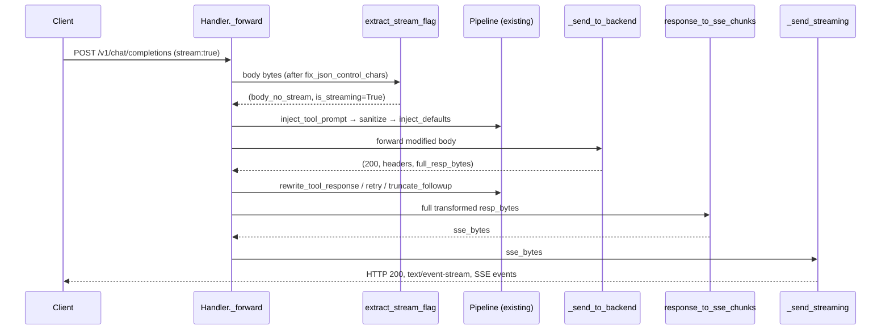
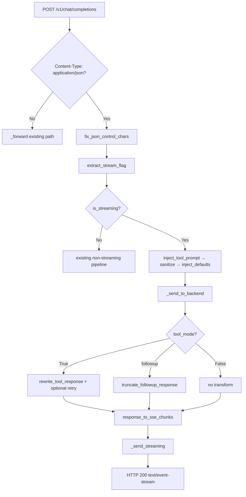

# Design Document: chat-completions-streaming

## Overview

This feature adds SSE (Server-Sent Events) streaming compatibility to the `/v1/chat/completions` endpoint of the Hailo-Hermes proxy. Clients that send `"stream": true` — including Home Assistant's `extended_openai_conversation` integration — currently receive either an error or an incompatible non-SSE response, because hailo-ollama's backend does not support OpenAI-compatible streaming on this path.

The approach is **fake streaming**: when the proxy detects `"stream": true` on an incoming request, it strips the flag before forwarding, collects the full hailo-ollama response, runs the complete existing transformation pipeline, and then re-emits the result as a well-formed two-event SSE stream. This preserves all existing behaviours (tool call rewriting, retry-on-rejection, follow-up truncation, debug logging) without modification, since those transforms require the full response body.

**Users**: API clients (e.g. Home Assistant's `extended_openai_conversation`) that set `stream: true` on chat completion requests.  
**Impact**: Adds a new streaming response path in `proxy.py`; non-streaming requests and all other endpoints are entirely unaffected.

### Goals
- Accept and correctly handle `POST /v1/chat/completions` requests with `"stream": true`.
- Emit a protocol-compliant OpenAI SSE response (two `data:` events + `data: [DONE]`).
- Preserve all existing request/response transformation logic unchanged.

### Non-Goals
- Real token-by-token streaming to hailo-ollama.
- Streaming on native `/api/chat` or `/api/generate` endpoints.
- Changes to non-streaming behaviour or any other endpoint.
- Handling `"stream_options"` or per-token usage statistics in the stream.

---

## Boundary Commitments

### This Spec Owns
- Detection and stripping of `"stream": true` from `/v1/chat/completions` request bodies.
- Emission of a valid OpenAI SSE response when streaming was requested.
- Conversion of a full OpenAI-format JSON response into the SSE chunk format.

### Out of Boundary
- The behaviour of hailo-ollama's backend (unchanged).
- All existing transformation functions (`fix_json_control_chars`, `inject_tool_prompt`, `sanitize_for_hailo`, `sanitize_conversation_roles`, `inject_defaults`, `rewrite_tool_response`, `truncate_followup_response`, `perturb_for_retry`) — these are not modified.
- Streaming on any endpoint other than `POST /v1/chat/completions`.

### Allowed Dependencies
- Python stdlib: `json`, `http.server`, `time` (for `created` timestamp).
- All existing proxy functions (called in the same order, unmodified).

### Revalidation Triggers
- Changes to the OpenAI streaming chunk schema.
- Changes to `_forward()` pipeline order or addition of new transforms.
- Changes to how `rewrite_tool_response` signals `tool_calls` in the response.

---

## Architecture

### Existing Architecture Analysis

The proxy is a single-file Python script (`proxy.py`) built on `http.server.BaseHTTPRequestHandler`. The entire request/response lifecycle is handled in `Handler._forward()`:

1. Read raw body → `fix_json_control_chars` → `inject_tool_prompt` → `sanitize_conversation_roles` → `sanitize_for_hailo` → `inject_defaults`
2. `_send_to_backend()` — synchronous blocking call, returns `(status, headers, resp_body_bytes)`
3. Conditional response transforms: `rewrite_tool_response` + retry, or `truncate_followup_response`
4. `_send()` — writes HTTP response with `Content-Length`

The current `_send()` always writes `Content-Length`, which is incompatible with SSE (byte length is not fixed in advance when streaming).

### Architecture Pattern & Boundary Map



**Architecture Integration**:
- Selected pattern: Pipeline extension — insert a strip step at the front, a conversion step at the back; no structural change to the pipeline itself.
- Existing patterns preserved: all transforms, retry logic, debug logging.
- New components: `extract_stream_flag` (module-level function), `response_to_sse_chunks` (module-level function), `Handler._send_streaming` (method).

### Technology Stack

| Layer | Choice / Version | Role in Feature | Notes |
|-------|------------------|-----------------|-------|
| Runtime | Python 3.x (stdlib only) | Proxy execution | No new dependencies |
| HTTP server | `http.server.BaseHTTPRequestHandler` | Request handling | `_send_streaming` omits `Content-Length` |
| Serialisation | `json` (stdlib) | SSE chunk construction | Existing usage |
| Time | `time` (stdlib) | `created` field in SSE chunk | Already imported indirectly or added inline |

---

## File Structure Plan

### Modified Files
- `proxy.py` — three new module-level functions + one new `Handler` method + two lines in `_forward()`.

```
proxy.py
├── extract_stream_flag()       # NEW — detects and strips "stream": true
├── response_to_sse_chunks()    # NEW — converts full response to SSE bytes
├── Handler
│   ├── _send_streaming()       # NEW — emits SSE HTTP response
│   └── _forward()              # MODIFIED — stream detection + SSE dispatch
└── (all other functions)       # UNCHANGED
```

---

## System Flows

### Streaming Request Flow



### SSE Emission Format

For a **content response** (no tool_calls):

```
data: {"id":"<id>","object":"chat.completion.chunk","created":<ts>,"model":"<model>","choices":[{"index":0,"delta":{"role":"assistant","content":"<text>"},"finish_reason":null}]}\n\n
data: {"id":"<id>","object":"chat.completion.chunk","created":<ts>,"model":"<model>","choices":[{"index":0,"delta":{},"finish_reason":"stop"}]}\n\n
data: [DONE]\n\n
```

For a **tool_calls response**:

```
data: {"id":"<id>","object":"chat.completion.chunk","created":<ts>,"model":"<model>","choices":[{"index":0,"delta":{"role":"assistant","tool_calls":[...]},"finish_reason":null}]}\n\n
data: {"id":"<id>","object":"chat.completion.chunk","created":<ts>,"model":"<model>","choices":[{"index":0,"delta":{},"finish_reason":"tool_calls"}]}\n\n
data: [DONE]\n\n
```

---

## Requirements Traceability

| Requirement | Summary | Components | Interfaces |
|-------------|---------|------------|------------|
| 1.1 | Detect `stream: true` on `/v1/chat/completions` | `extract_stream_flag` | Returns `(bytes, bool)` |
| 1.2 | Non-streaming requests unchanged | `_forward` branch on `is_streaming` | Existing path untouched |
| 1.3 | Detection after `fix_json_control_chars` | `_forward` ordering | Called on clean JSON bytes |
| 2.1 | Strip `stream` key before forwarding | `extract_stream_flag` | Returns body without `stream` key |
| 2.2 | All transforms run on modified body | `_forward` pipeline | Same call order |
| 2.3 | Collect full response before SSE emission | `_send_to_backend` unchanged | Returns `resp_body_bytes` |
| 3.1 | HTTP 200 + `text/event-stream` | `_send_streaming` | No `Content-Length` header |
| 3.2 | Two `data:` events + `[DONE]` | `response_to_sse_chunks` | Returns `bytes` |
| 3.3 | Correct OpenAI chunk format | `response_to_sse_chunks` | `chat.completion.chunk` object |
| 3.4 | `tool_calls` finish_reason and delta | `response_to_sse_chunks` | Inspects `message.tool_calls` |
| 3.5 | No `Content-Length` on streaming response | `_send_streaming` | Omits header |
| 4.1 | `rewrite_tool_response` runs before SSE | `_forward` ordering | After backend call |
| 4.2 | Retry-on-rejection preserved | `_forward` existing retry block | Unchanged |
| 4.3 | `truncate_followup_response` preserved | `_forward` existing followup block | Unchanged |
| 4.4 | Debug logging preserved | `_debug_log` calls unchanged | Unchanged |
| 5.1 | Backend HTTP errors forwarded | `_forward` HTTPError handler | Unchanged |
| 5.2 | Transport exceptions → 502 | `_forward` generic exception handler | Unchanged |
| 5.3 | JSON parse failure in SSE construction | `response_to_sse_chunks` fallback | Raw content in `delta.content` |

---

## Components and Interfaces

### Summary

| Component | Layer | Intent | Req Coverage | Key Dependencies |
|-----------|-------|--------|--------------|-----------------|
| `extract_stream_flag` | Transform (request) | Detect and strip `"stream"` key from body | 1.1, 1.2, 1.3, 2.1 | `json` |
| `response_to_sse_chunks` | Transform (response) | Convert full response to SSE bytes | 3.1–3.5, 5.3 | `json`, `time` |
| `Handler._send_streaming` | HTTP (response) | Emit SSE-formatted HTTP response | 3.1, 3.5 | `http.server` write primitives |
| `Handler._forward` (modified) | Orchestration | Route streaming vs non-streaming | 1.1–5.2 | All above |

---

### Request Transform Layer

#### `extract_stream_flag`

| Field | Detail |
|-------|--------|
| Intent | Parse the (already JSON-clean) body, extract the boolean value of `"stream"`, remove the key from the body, and return both. |
| Requirements | 1.1, 1.2, 1.3, 2.1, 2.2 |

**Responsibilities & Constraints**
- Must not modify the body for non-JSON or unparseable content.
- Must not alter any key other than `"stream"`.
- Must treat `"stream": false` and absent `"stream"` identically (return `is_streaming=False`).
- Runs after `fix_json_control_chars` and before `inject_tool_prompt`.

**Dependencies**
- Inbound: raw body bytes (clean JSON) from `fix_json_control_chars`
- External: `json` (stdlib)

**Contracts**: Service [x]

##### Service Interface
```python
def extract_stream_flag(body_bytes: bytes) -> tuple[bytes, bool]:
    """
    Parse body_bytes as JSON, remove the "stream" key, and return
    (modified_body_bytes, is_streaming).

    - If "stream" is absent or False: returns (body_bytes_unchanged, False).
    - If "stream" is True: returns (body_without_stream_key, True).
    - If body_bytes is not valid JSON: returns (body_bytes, False).
    """
```
- Preconditions: `body_bytes` is UTF-8 encoded, contains valid JSON (after `fix_json_control_chars`).
- Postconditions: returned bytes are valid JSON if input was valid JSON; `"stream"` key is absent from returned bytes when `is_streaming=True`.
- Invariants: all other keys in the JSON object are preserved exactly.

---

### Response Transform Layer

#### `response_to_sse_chunks`

| Field | Detail |
|-------|--------|
| Intent | Convert a complete OpenAI-format JSON response body into a sequence of SSE data lines that comply with the OpenAI streaming protocol. |
| Requirements | 3.2, 3.3, 3.4, 5.3 |

**Responsibilities & Constraints**
- Must emit exactly two `data:` events followed by `data: [DONE]\n\n`.
- Must produce a `chat.completion.chunk` object, not a `chat.completion` object.
- First event: delta carries content (or tool_calls), `finish_reason: null`.
- Second event: delta is empty `{}`, `finish_reason: "stop"` or `"tool_calls"`.
- If `resp_body_bytes` cannot be parsed as JSON, falls back to wrapping the raw decoded text as `delta.content`.
- Does not call any other proxy functions; is a pure data transformation.

**Dependencies**
- Inbound: fully-transformed response bytes from `_forward` pipeline
- External: `json` (stdlib), `time` (stdlib, for `created` timestamp)

**Contracts**: Service [x]

##### Service Interface
```python
def response_to_sse_chunks(resp_body_bytes: bytes) -> bytes:
    """
    Convert a complete OpenAI chat.completion JSON response into SSE bytes.

    Output format (content case):
        data: {chunk1_json}\n\n
        data: {chunk2_stop_json}\n\n
        data: [DONE]\n\n

    Output format (tool_calls case):
        data: {chunk1_tool_calls_json}\n\n
        data: {chunk2_stop_json, finish_reason="tool_calls"}\n\n
        data: [DONE]\n\n

    Falls back to wrapping raw text in delta.content if JSON parse fails.
    """
```
- Preconditions: `resp_body_bytes` is the fully-transformed backend response.
- Postconditions: returned bytes are valid UTF-8; start with `b"data: "` and end with `b"data: [DONE]\n\n"`.
- Invariants: `id`, `model`, `created` fields from the original response are forwarded into each chunk; if absent, sensible defaults are used (`"chatcmpl-stream"`, `""`, `int(time.time())`).

##### SSE Chunk Schema

**Chunk 1 (content)**:
```json
{
  "id": "<from original response or 'chatcmpl-stream'>",
  "object": "chat.completion.chunk",
  "created": <unix timestamp>,
  "model": "<from original response or ''>",
  "choices": [{
    "index": 0,
    "delta": {"role": "assistant", "content": "<message content or ''>"},
    "finish_reason": null
  }]
}
```

**Chunk 1 (tool_calls)**:
```json
{
  "id": "...", "object": "chat.completion.chunk", "created": ..., "model": "...",
  "choices": [{
    "index": 0,
    "delta": {"role": "assistant", "tool_calls": [<tool call objects>]},
    "finish_reason": null
  }]
}
```

**Chunk 2 (stop)**:
```json
{
  "id": "...", "object": "chat.completion.chunk", "created": ..., "model": "...",
  "choices": [{"index": 0, "delta": {}, "finish_reason": "stop"}]
}
```
*(`finish_reason` is `"tool_calls"` when tool_calls were present in chunk 1)*

---

### HTTP Response Layer

#### `Handler._send_streaming`

| Field | Detail |
|-------|--------|
| Intent | Emit a well-formed HTTP 200 SSE response without a `Content-Length` header. |
| Requirements | 3.1, 3.5 |

**Responsibilities & Constraints**
- Must set `Content-Type: text/event-stream`.
- Must **not** set `Content-Length` (body length is not pre-declared in SSE).
- Writes the entire SSE body in a single `wfile.write()` call.
- Does not set `Transfer-Encoding` explicitly (connection close is sufficient for clients that read until EOF).

**Dependencies**
- Inbound: `sse_body: bytes` from `response_to_sse_chunks`
- External: `self.send_response`, `self.send_header`, `self.end_headers`, `self.wfile.write` (from `BaseHTTPRequestHandler`)

**Contracts**: Service [x]

##### Service Interface
```python
def _send_streaming(self, sse_body: bytes) -> None:
    """
    Write an HTTP 200 response with Content-Type text/event-stream.
    Does not include Content-Length. Writes sse_body to the socket.
    """
```
- Preconditions: `sse_body` is valid UTF-8 SSE bytes; HTTP response headers have not yet been sent.
- Postconditions: full HTTP response written to `self.wfile`.

---

### Orchestration Layer

#### `Handler._forward` (modified)

| Field | Detail |
|-------|--------|
| Intent | Detect streaming requests and route to the SSE path after the full transformation pipeline completes. |
| Requirements | 1.1–5.2 |

**Responsibilities & Constraints**
- `extract_stream_flag` is called immediately after `fix_json_control_chars` and before `inject_tool_prompt`.
- `is_streaming` is stored as a local variable for use at the end of the method.
- All existing transform calls, backend forwarding, rewrite, retry, and truncate logic remain in the exact same positions.
- Only the final dispatch changes: if `is_streaming`, call `response_to_sse_chunks` then `_send_streaming`; otherwise call `_send` as today.
- The `_debug_log` call for the response occurs before the streaming/non-streaming branch so it always executes.

**Modified `_forward` pseudo-structure** (additions marked `# NEW`):
```python
def _forward(self):
    ...
    if body and content_type.startswith('application/json'):
        body = fix_json_control_chars(body)
        body, is_streaming = extract_stream_flag(body)   # NEW
        body, tool_mode = inject_tool_prompt(body)
        ...
        body = inject_defaults(body, self.path)
    try:
        status, headers, resp_body = self._send_to_backend(body, label='')
        ...
        # [all existing rewrite / retry / truncate logic — unchanged]
        ...
        _debug_log('RES', status, self.path, resp_body)
        if is_streaming:                                  # NEW
            sse = response_to_sse_chunks(resp_body)       # NEW
            self._send_streaming(sse)                     # NEW
        else:
            self._send(status, resp_body, content_type)
    except urllib.error.HTTPError as exc:
        ...  # unchanged
    except Exception as exc:
        ...  # unchanged
```

---

## Error Handling

### Error Strategy
Fail-safe: any error in the streaming path falls back to the same error responses as the non-streaming path.

### Error Categories and Responses

| Scenario | Handling | Requirement |
|----------|----------|-------------|
| `extract_stream_flag` receives invalid JSON | Returns `(original_bytes, False)` — treated as non-streaming | 1.1, 5.2 |
| `response_to_sse_chunks` receives invalid JSON | Wraps raw text in `delta.content`; emits valid SSE | 5.3 |
| Backend returns HTTP error (4xx/5xx) | `urllib.error.HTTPError` handler fires; SSE path not reached | 5.1 |
| Transport exception | Generic exception handler fires; 502 returned | 5.2 |
| `_send_streaming` write failure | Exception propagates to generic handler; logged to stderr | 5.2 |

### Monitoring
- All existing `_debug_log` calls are preserved; streaming responses are logged at the same verbosity levels.
- A `[proxy]` stderr line is emitted when `extract_stream_flag` strips the flag: `[proxy] streaming request detected on /v1/chat/completions`.
